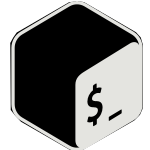

<h1 align="center">Hi 👋, I'm Derek Lee Nen That</h1>

- 🔭 I’m currently working on **Finishing Uni**

- 🌱 I’m currently learning **Unity, Front-End tools**

- 🤝 I’m looking for help with **Neovim config**

- ⚡ Fun fact **I am a die-hard keyboard enthusiast and foodie**

### 📫 Contact me:

<h3 align="center">Languages and Tools:</h3>

 

 

  
  

&nbsp;

